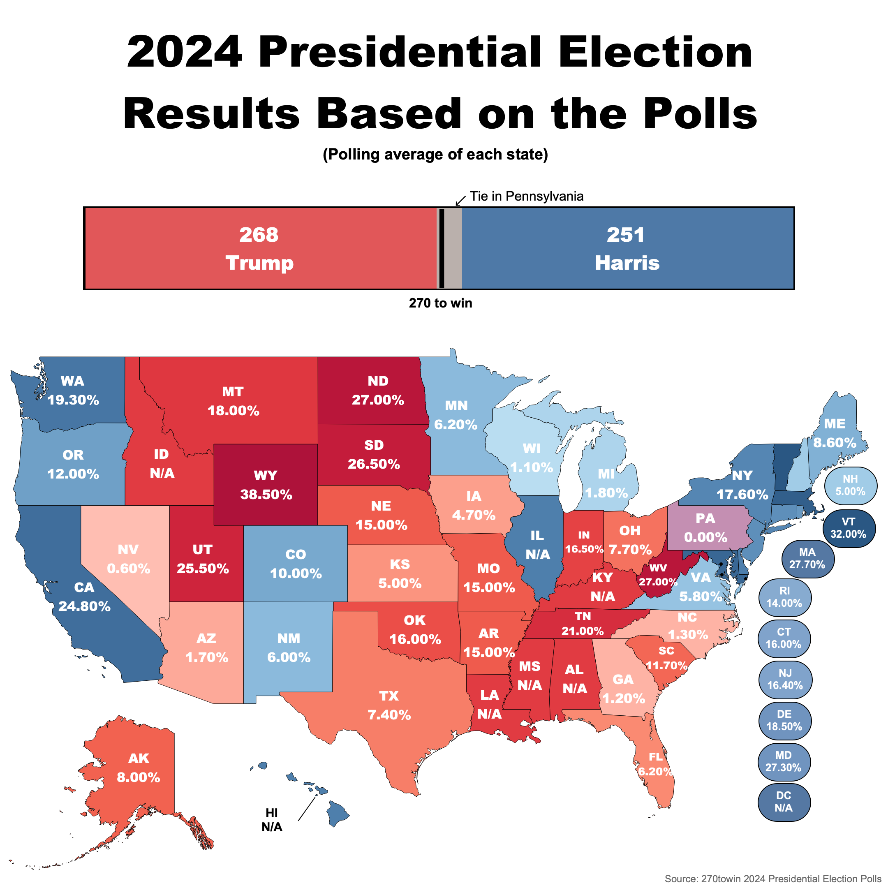
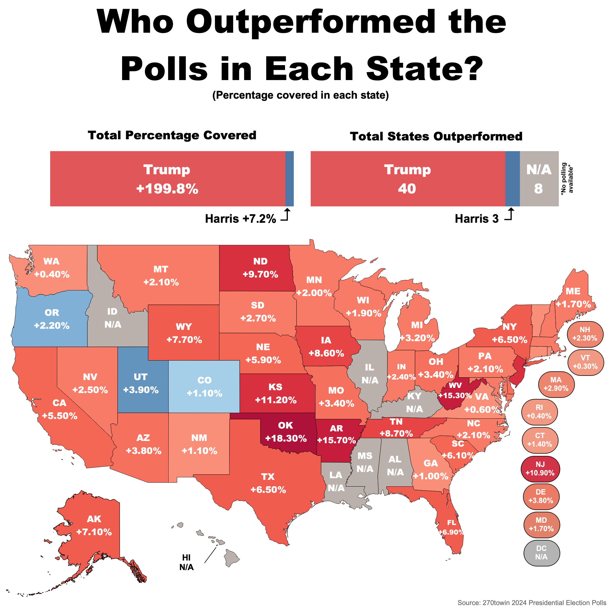
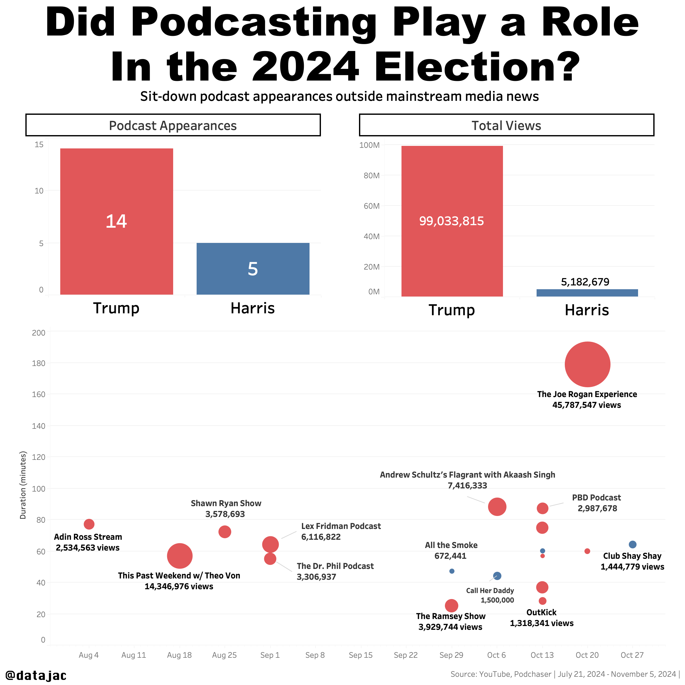
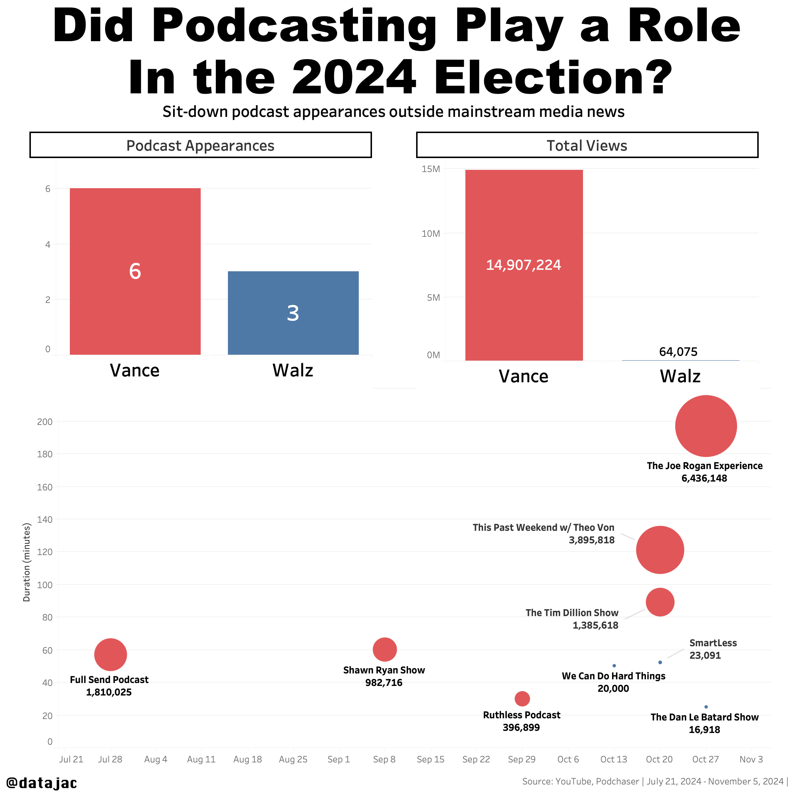

# 2024 U.S Presidential Election Visualizations (2024)

<table style="width: 100%;">
  <!-- Row 1: Images -->
  <tr>
    <td align="center" valign="top" style="width: 50%;">
      
    </td>
    <td align="center" valign="top" style="width: 50%;">
      
    </td>
  </tr>

  <!-- Row 2: Text spanning both columns -->
  <tr>
    <td colspan="2" align="center" valign="top" style="padding-top: 10px;">
      

        <strong>2024 Presidential Election Polling Visualizations</strong>
        

           
          The first visualization displays a map of the United States showing projected electoral outcomes for the 2024 presidential election based on state-level polling averages. 
          Each state is color-coded to represent the leading candidate according to the polls.
          The second visualization illustrates the difference between actual election results and pre-election polling across all 50 states. It uses a color-coded map to indicate which 
          candidate outperformed or underperformed the polling expectations in each state.
        

      

    </td>
  </tr>
</table>

  

<table style="width: 100%;">
  <!-- Row 1: Images -->
  <tr>
    <td align="center" valign="top" style="width: 50%;">
      
    </td>
    <td align="center" valign="top" style="width: 50%;">
      
    </td>
  </tr>

  <!-- Row 2: Text spanning both columns -->
  <tr>
    <td colspan="2" align="center" valign="top" style="padding-top: 10px;">
      

        <strong>The Influence of Podcasting in the 2024 U.S. Election</strong>
        

           
          These visualizations examines the impact of podcast appearances on the 2024 U.S. presidential election, comparing the number of interviews and total viewership for the 2024 
          presidential and vice-presidential nominees. The layouts include bar charts that present the frequency of podcast appearances and cumulative views for each candidate, 
          alongside scatter plots that map out the timing, duration, and relative audience size of each individual podcast episode. 
      

    </td>
  </tr>
</table>

